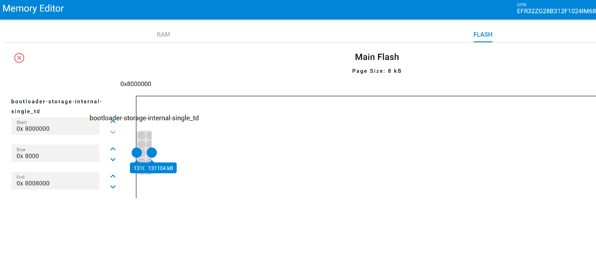
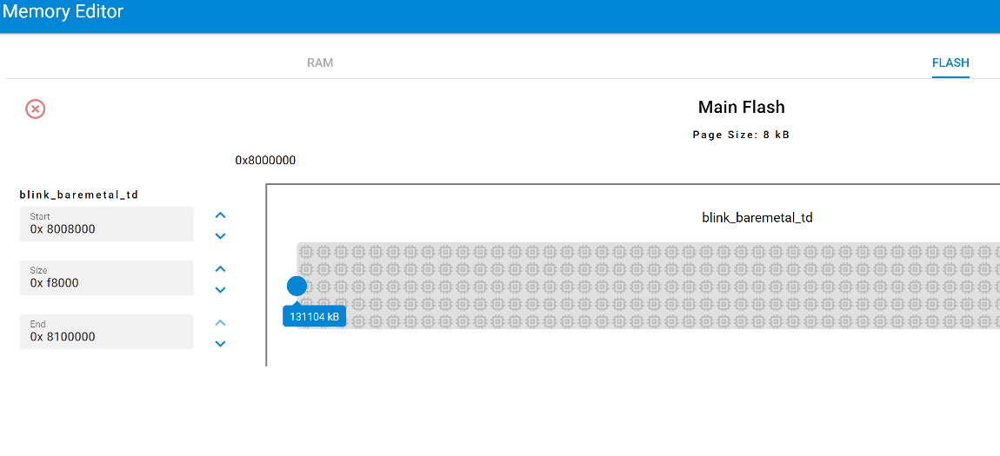

# Change size of bootloader



## Introduction

Bootloader is configurable on EFR32. Sometimes, because several features have been added to the bootloader (decompression, parser with decryption, usage of PLL, etc), it does not fit into the default bootloader region and this leads to link error at compilation.

When this error happens, it is necessary to increase size of the bootloader memory area.This guide will help you to modify the bootloader storage region.

## Modifying bootloader

* Modify **BTL_APPLICATION_BASE** macro of **btl_interface.h file** with the new start address of application. As an example on EFR32FG28, the new value can be **FLASH_BASE + 0x00008000UL** 

*	Modify **BTL_UPGRADE_LOCATION_BASE** macro in bootloader core component. A value greater than **BTL_APPLICATION_BASE** should be selected

*	Modify the bootloader region area either directly in the linker sript **(autogen/linkerfile.ld)** or with the memory editor tool:

## Modifying the application

* Modify **BTL_APPLICATION_BASE** macro of **btl_interface.h file** with the new start address of application. As an example on EFR32FG28, the new value can be **FLASH_BASE + 0x00008000UL** 

*	Modify the application region area either directly in the linker sript **(autogen/linkerfile.ld)** or with the memory editor tool:

Keep in mind that the values of **BTL_APPLICATION_BASE** and **BTL_UPGRADE_LOCATION_BASE** should be page aligned.