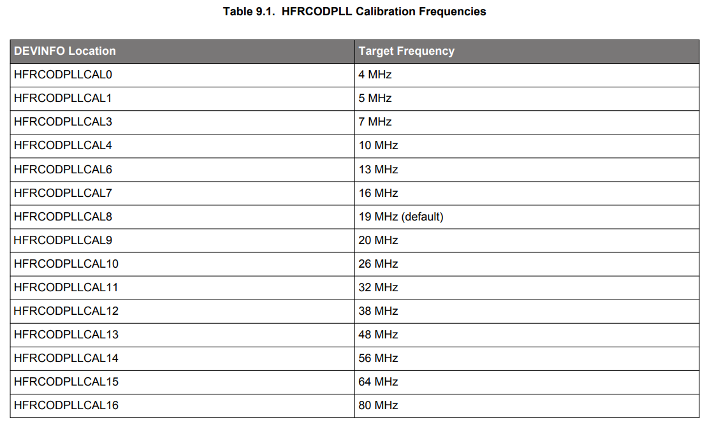
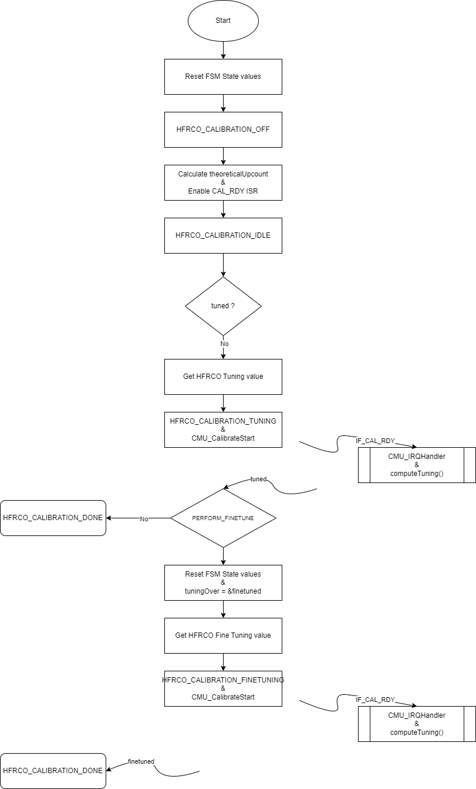

# Project Implementation

## Project Architecture

The goal of this project is to perform a single 20MHz running HFRCO calibration against HFXO while staying in EM1.

Once over, we let the MCU go into EM2

Implementation is mostly inspired by the one from [this repo](https://github.com/SiliconLabs/peripheral_examples/blob/master/series2/cmu/lfrco_cal_interrupt/src/main_xg21.c#L148)

Major changes were required to have it work on EFR32MG24 :

* Addition of fine tuning to achieve better results
* The HFRCOEM23 Tuning logic is the opposite of the examples' one : The higher tuning is, the lower is the output frequency

## Project Code

### HFRCO Initialization

By default, HFRCO will be enabled but not used as sample applications use HFXO unless otherwise configured

Therefore we need to perform simple configuration steps prior to any other, which will be put in `initHFRCOEM23` :

```c
static void initHFRCOEM23(void){
  CMU_ClockEnable(cmuClock_HFRCOEM23, true);

  HFRCOEM23->CAL = DEVINFO->HFRCOEM23CAL[HFRCOEM23_CAL_INDEX].HFRCOEM23CAL;//Calibration indexes are available in RM section 9.3.3.3
  //HFRCOEM23->CTRL |= HFRCO_CTRL_EM23ONDEMAND;
  HFRCOEM23->CTRL |= HFRCO_CTRL_FORCEEN;//We keep HFRCO enabled for debug purposes since no other peripheral consumes it
  // Drive HFRCO onto PB5 to observe calibration
  CMU_ClkOutPinConfig(2, cmuSelect_HFRCOEM23, 4, gpioPortB, 5);
}
```

Defines being :

```c
#define HFRCOEM23_DESIRED_FREQ      20000000

#if (HFRCOEM23_DESIRED_FREQ == 20000000)
#define HFRCOEM23_CAL_INDEX         9
#else
#define HFRCOEM23_CAL_INDEX         8//19MHz otherwise
#endif
```

Defines are used to select pre-calibration values from DEVINFO page as per reference manual section 9.3.3.3 :



As we want to observe the output frequency, we do also set it on GPIO PortB 5 (as ports A and B are the only availble ones in EM2)

### CMU Initialization

CMU Calibration FSM will be based on the previously described theory of operation. Prior to starting it, it is required to set the CMU first. All state variables are initialized in dedicated `resetCmuCalibrationFsm`, except theoreticalUpcount which is calculated once in `initCmuCalibrationFsm`.

Finally, we enable CMU_IEN_CALRDY interrupt to perform this without involving the MCU and remain in EM1

The setup code is loacted in `initCmuCalibrationFsm` :

```c
static void initCmuCalibrationFsm(void)
{
  resetCmuCalibrationFsm();

  // Determine ideal up count based on the desired frequency
  theoreticalUpcount = (uint32_t)(((float)HFRCOEM23_DESIRED_FREQ / (float)SystemHFXOClockGet()) * (float)(DOWNCOUNT + 1));

  // Setup the calibration circuit
  CMU_CalibrateConfig(DOWNCOUNT, cmuSelect_HFXO, cmuSelect_HFRCOEM23);

  // Enable continuous calibration
  CMU_CalibrateCont(true);

  // Enable calibration ready interrupt
  CMU_IntClear(_CMU_IF_MASK);
  CMU_IntEnable(CMU_IEN_CALRDY);
  NVIC_ClearPendingIRQ(CMU_IRQn);
  NVIC_EnableIRQ(CMU_IRQn);

  calibrationState = HFRCO_CALIBRATION_IDLE;
}
```

Where `resetCmuCalibrationFsm` is :

```c
static void resetCmuCalibrationFsm(void)
{
  calibrationState = HFRCO_CALIBRATION_OFF;
  tuned = false;
  finetuned = false;
  lastCalcUpcountGT = false;
  lastCalcUpcountLT = false;
  currentTuningVal = 0;
  newTuningVal = 0;
  previousUpcount = 0;
  tuningOver = &tuned;
}
```

For this example we will set downcount to its max value. This will provide us with a worst case scenario for time and power consumption.

Depending on accuracy requirements, it is possible to reduce this amount of ticks.

As mentioned above, Silicon Labs Series 2 HFRCO has a HFRCOEM23->CAL.FINETUNE register field allowing for an even better tune of the HFRCO frequency. We defined `PERFORM_FINETUNE` to enable a second round of tuning using that specific register.

Defines used are set to :

```c
#define DOWNCOUNT                   0xFFFFF
#define PERFORM_FINETUNE            1
```

Global variables are also required in this context :

```c
// Global variables used in calibration ISR // TODO - could be an object like typedef struct
static HFRCO_Calibration_State_t calibrationState;
static bool tuned, finetuned, lastCalcUpcountGT, lastCalcUpcountLT;
static uint32_t theoreticalUpcount, previousUpcount, currentTuningVal, newTuningVal;
```

Finally, we define a pointer to a boolean which will allow us to reuse the same FSM for both tuning and fine tuning :

```c
bool *tuningOver;
```

Once all the settings are covered, we need to implement the actual algorithm that will perform tuning and finetuning using the CMU ISR.

### Tuning FSM

The state machine is defined in the `app_process_action` function:

```c
  switch (calibrationState) {
    case HFRCO_CALIBRATION_IDLE:
      if(!tuned){
        // Get current tuningVal value
        currentTuningVal = CMU_OscillatorTuningGet(cmuOsc_HFRCOEM23);
        calibrationState = HFRCO_CALIBRATION_TUNING;
        // Start the up counter
        CMU_CalibrateStart();
      }
      break;
    case HFRCO_CALIBRATION_TUNING:
      if(tuned)
      {
        if(PERFORM_FINETUNE)
        {
          resetCmuCalibrationFsm();
          tuningOver = &finetuned;
          // Get current fine tuning value
          currentTuningVal = CMU_OscillatorFineTuningGet(cmuOsc_HFRCOEM23);
          calibrationState = HFRCO_CALIBRATION_FINE_TUNING;
          // Start the up counter
          CMU_CalibrateStart();
        } else {
          calibrationState = HFRCO_CALIBRATION_DONE;
        }
      }
      break;
    case HFRCO_CALIBRATION_FINE_TUNING:
      if(finetuned)
      {
        calibrationState = HFRCO_CALIBRATION_DONE;
      }
      break;
    case HFRCO_CALIBRATION_DONE:
      break;
    default:
      break;
  }
```

It is made of 3 main elements :

* `calibrationState` which holds the current state of the tuning FSM
* `tuned` which informs if tuning has been performed
* `finetuned` which informs if fine tuning has been performed

> TODO : Implementation can be much more optimized and refactored

The FSM is currently defined as below :



### EMLIB extension

Silicon Labs' EMLIB CMU module does not provide FineTuning getter and setter

We therefore created thos in app.c based on the tuning ones : 

```c
/***************************************************************************//**
 * @brief
 *   Get oscillator frequency fine tuning setting.
 *
 * @param[in] osc
 *   Oscillator to get fine tuning value for.
 *
 * @return
 *   The oscillator frequency fine tuning setting in use.
 ******************************************************************************/
uint32_t CMU_OscillatorFineTuningGet(CMU_Osc_TypeDef osc)
{
  uint32_t ret = 0U;

  switch (osc) {

    case cmuOsc_HFRCODPLL:
#if defined(CMU_CLKEN0_HFRCO0)
      CMU->CLKEN0_SET = CMU_CLKEN0_HFRCO0;
#endif
      ret = (HFRCO0->CAL & _HFRCO_CAL_FINETUNING_MASK) >> _HFRCO_CAL_FINETUNING_SHIFT;
      break;

#if defined(HFRCOEM23_PRESENT)
    case cmuOsc_HFRCOEM23:
      ret = (HFRCOEM23->CAL & _HFRCO_CAL_FINETUNING_MASK) >> _HFRCO_CAL_FINETUNING_SHIFT;
      break;
#endif

    default:
      EFM_ASSERT(false);
      break;
  }

  return ret;
}

/***************************************************************************//**
 * @brief
 *   Set the oscillator frequency finetuning control.
 *
 * @note
 *   Oscillator finetuning is done during production, and the finetuning value is
 *   automatically loaded after a reset. Changing the finetuning value from the
 *   calibrated value is for more advanced use. Certain oscillators also have
 *   build-in finetuning optimization.
 *
 * @param[in] osc
 *   Oscillator to set finetuning value for.
 *
 * @param[in] val
 *   The oscillator frequency finetuning setting to use.
 ******************************************************************************/
void CMU_OscillatorFineTuningSet(CMU_Osc_TypeDef osc, uint32_t val)
{
  switch (osc) {

    case cmuOsc_HFRCODPLL:
#if defined(CMU_CLKEN0_HFRCO0)
      CMU->CLKEN0_SET = CMU_CLKEN0_HFRCO0;
#endif
      EFM_ASSERT(val <= (_HFRCO_CAL_FINETUNING_MASK >> _HFRCO_CAL_FINETUNING_SHIFT));
      val &= _HFRCO_CAL_FINETUNING_MASK >> _HFRCO_CAL_FINETUNING_SHIFT;
      while ((HFRCO0->STATUS & HFRCO_STATUS_SYNCBUSY) != 0UL) {
      }
      HFRCO0->CAL = (HFRCO0->CAL & ~_HFRCO_CAL_FINETUNING_MASK)
                    | (val << _HFRCO_CAL_FINETUNING_SHIFT);
      break;

#if defined(HFRCOEM23_PRESENT)
    case cmuOsc_HFRCOEM23:
      EFM_ASSERT(val <= (_HFRCO_CAL_FINETUNING_MASK >> _HFRCO_CAL_FINETUNING_SHIFT));
      val &= _HFRCO_CAL_FINETUNING_MASK >> _HFRCO_CAL_FINETUNING_SHIFT;
      while ((HFRCOEM23->STATUS & HFRCO_STATUS_SYNCBUSY) != 0UL) {
      }
      HFRCOEM23->CAL = (HFRCOEM23->CAL & ~_HFRCO_CAL_FINETUNING_MASK)
                       | (val << _HFRCO_CAL_FINETUNING_SHIFT);
      break;
#endif

    default:
      EFM_ASSERT(false);
      break;
  }
}
```

### Tuning Value Search Implementation

Tuning value search is generic to both tuning AND fine tuning as these obey the same logic

Refer to previous section as to how search is performed. 

Implementation is located in `computeTuning` :

```c
static uint32_t computeTuning(uint32_t calculatedUpcount_a, uint32_t previousUpcount_a, uint32_t currentTuning_a, bool *tuned_a)
{
  uint32_t tuningVal = currentTuning_a;

  /*
   * If the up counter result is less than the tuned value, the LFRCO
   * is running at a lower frequency, so the tuning value has to be
   * decremented.
   */
  if (calculatedUpcount_a < theoreticalUpcount)
  {
    // Was the up counter greater than the tuned value on the last run?
    if (lastCalcUpcountGT)
    {
      /*
       * If the difference between the ideal count and the up count
       * from this run is greater than it was on the last run, then
       * the last run produced a more accurate tuning, so revert to
       * the previous tuning value.  If not, the current value gets
       * us the most accurate tuning.
       */
      if ((theoreticalUpcount - calculatedUpcount_a) > (previousUpcount_a - theoreticalUpcount))
        tuningVal = currentTuning_a;

      // Done tuning now
      *tuned_a = true;
    }
    // Up counter for the last run not greater than the tuned value
    else
    {
      /*
       * If the difference is 1, incrementing the tuning value again
       * will only increase the frequency further away from the
       * intended target, so tuning is now complete.
       */
      if ((theoreticalUpcount - calculatedUpcount_a) == 1)
        *tuned_a = true;
      /*
       * The difference between this run and the ideal count for the
       * desired frequency is > 1, so increase the tuning value to
       * increase the LFRCO frequency.  After the next calibration run,
       * the up counter value will increase.  Save the tuning value
       * from this run; if it's close, it might be more accurate than
       * the result from the next run.
       */
      else
      {
        //prevTuning = tuningVal;
        tuningVal--;
        lastCalcUpcountLT = true;  // Remember that the up counter was less than the ideal this run
        //prevUp = calculatedUpcount_a;
      }
    }
  }

  /*
   * If the up counter result is greater than the tuned value, the
   * HFRCO is running at a higher frequency, so the tuning value has
   * to be incremented.
   */
  if (calculatedUpcount_a > theoreticalUpcount)
  {
    // Was the up counter less than the tuned value on the last run?
    if (lastCalcUpcountLT)
    {
      /*
       * If the difference between the up count and the ideal count
       * from this run is greater than it was on the last run, then
       * the last run produced a more accurate tuning, so revert to
       * the previous tuning value.  If not, the current value gets
       * the most accurate tuning.
       */
      if ((calculatedUpcount_a - theoreticalUpcount) > (theoreticalUpcount - previousUpcount_a))
        tuningVal = currentTuning_a;

      // Done tuning now
      *tuned_a = true;
    }
    // Up counter for the last run not less than the tuned value
    else
    {
      /*
       * If the difference is 1, decrementing the tuning value again
       * will only decrease the frequency further away from the
       * intended target, so tuning is now complete.
       */
      if ((calculatedUpcount_a - theoreticalUpcount) == 1)
        *tuned_a = true;
      /*
       * The difference between this run and the ideal count for the
       * desired frequency is > 1, so decrease the tuning value to
       * decrease the LFRCO frequency.  After the next calibration run,
       * the up counter value will decrease.  Save the tuning value
       * from this run; if it's close, it might be more accurate than
       * the result from the next run.
       */
      else
      {
        //prevTuning = tuningVal;
        tuningVal++;
        lastCalcUpcountGT = true;  // Remember that the up counter was greater than the ideal this run
        //prevUp = calculatedUpcount_a;
      }
    }
  }

  return tuningVal;
}
```

Code is available in [this github repo](https://github.com/brian-silabs/BRD4186_HFRCO_Calibration).
