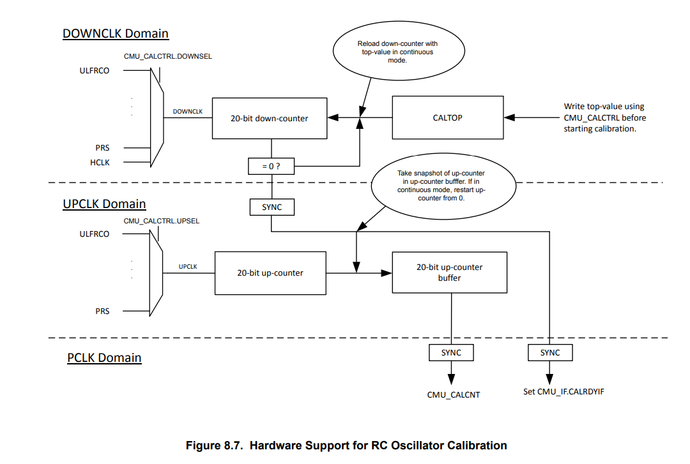
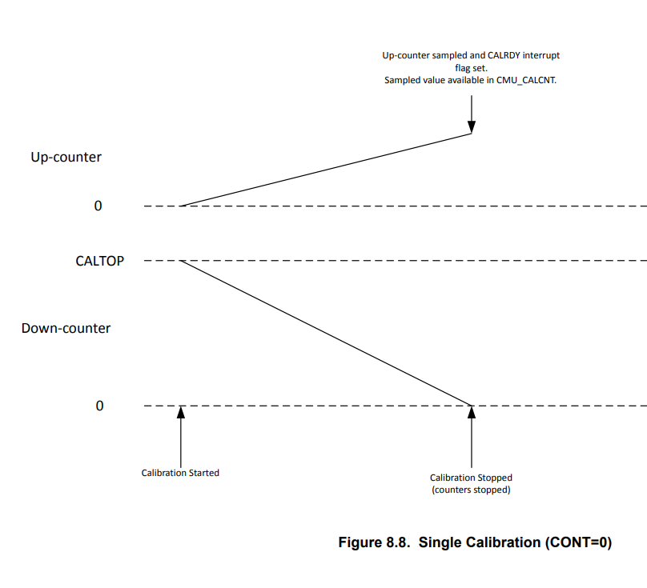

# Theory of Operation

Silicon Labs CMU (Clock Manegement Unit) has a dedicated calibration circuit

In this guide we will make use of this feature to create a calibration routine that we can call at any time to perform HFRCO calibration

## CMU Calibration circuit



CMU Calibration block is made of 2 counters, one counting up, the other counting down.

Each timer can be clocked by a selectable source.

## Operation

Refer to section 8.3.3 of [xG24 Reference Manual](https://www.silabs.com/documents/public/reference-manuals/efr32xg24-rm.pdf) for details.

A dedicated sample app has been written by Silicon Labs for EFR32xG21 on this [github repo](https://github.com/SiliconLabs/peripheral_examples/blob/master/series2/cmu/lfrco_cal_interrupt/src/main_xg21.c)

The down counter counts at speed of reference clock, from a user defined top value, down to 0. This will be referred to as **UPCOUNT** and it is a value that will be calculated.

The up counter counts from 0, up to 0xFFFFF, at the speed of the clock we wish to calibrate. This will be referred to as **DOWNCOUNT** and is a value user defined.



Time taken to perform the operation can be calculated as follows :

``` text
            DOWNCOUNT
  ----------------------------- = calibration time
   `Reference Clock frequency`
```

## Theoretical UPCOUNT value

Silicon Labs' CMU Calibration circuit will sync start both counters.

From there, during the amount of calibration time defined by our reference clock, our clock to calibrate will also count up to some value.

The CMU Calibration block will return us with a CAL_UPCOUNT value, that we can compare to the THEORETICAL_UPCOUNT value we would have expected if clock to calibrate was running at the desired frequency.

Ideal UPCOUNT value is deduced as follows :

```text
          THEORETICAL_UPCOUNT
  ------------------------------------ = calibration time
   `To be calibrated clock frequency`
```

Based on these two equations, we can then easily get the equation for THEORETICAL_UPCOUNT :

```text
                        `To be calibrated clock frequency` * DOWNCOUNT
  THEORETICAL_UPCOUNT = -----------------------------------------------
                                  `Reference Clock frequency`
```

## THEORETICAL_UPCOUNT and CAL_UPCOUNT usage

Performing this procedure once will unfortunately just tell if our clock is slower or faster than expected as per below :

If CAL_UPCOUNT > THEORETICAL_UPCOUNT, this means our clock to calibrate is running faster than expected
If CAL_UPCOUNT < THEORETICAL_UPCOUNT, this means our clock to calibrate is running slower than expected
If CAL_UPCOUNT == THEORETICAL_UPCOUNT, this means our clock to calibrate is running at the desireed frequence

Therefore, to take advantage of this, it is required to run this procedure several times, while correcting the tuning value of our clock to calibrate between each iteration.

Knowing the above, we setup the calibration procedure to be continuous, and enable IRQs. This way we can reiterate while leaving the MCU alone as long as we reach a desired target.

---

Using the CAL_UPCOUNT value is therefore up to the user. Several algorithms exist, in this case we will reuse the search algorithm provided by Silicon Labs as part of their existing sample application :

If the CAL_UPCOUNT is below the THEORETICAL_UPCOUNT, we increase the oscillator tuning value by 1 until CAL_UPCOUNT > THEORETICAL_UPCOUNT

  > At this point we apply the best deduced tuning value determined

If the CAL_UPCOUNT is above the THEORETICAL_UPCOUNT, we decrease the oscillator tuning value by 1 until CAL_UPCOUNT < THEORETICAL_UPCOUNT

  > At this point we apply the best deduced tuning value determined

Best is either :

* Difference of 1 between THEORETICAL_UPCOUNT and CAL_UPCOUNT
* If we crossed THEORETICAL_UPCOUNT, which was the closest CAL_UPCOUNT between iteration and iteration - 1

    This is ran because tuning±1 has a much bigger impact than ±1 on the actual frequency, hence CAL_UPCOUNT.

## Tuning and Fine Tuning

Silicon Labs Series 2 devices HFRCO controller also has a FINETUNING field, which allows for better control over target frequency. This register filed works just as the regular tuning value (the higher tuning value, the lower the RC frequency)

Therefore we will perform both tuning searches to achieve best resolution. Tuning first, fine tuning second.