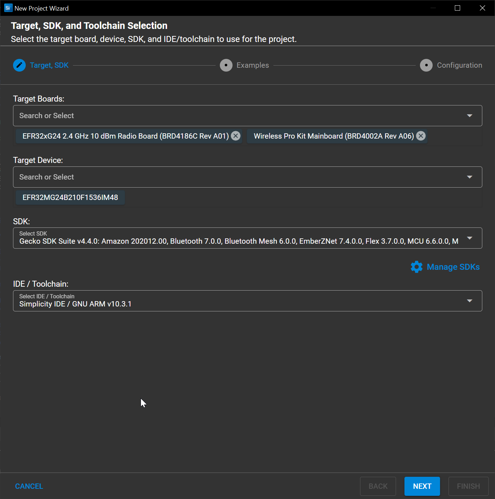
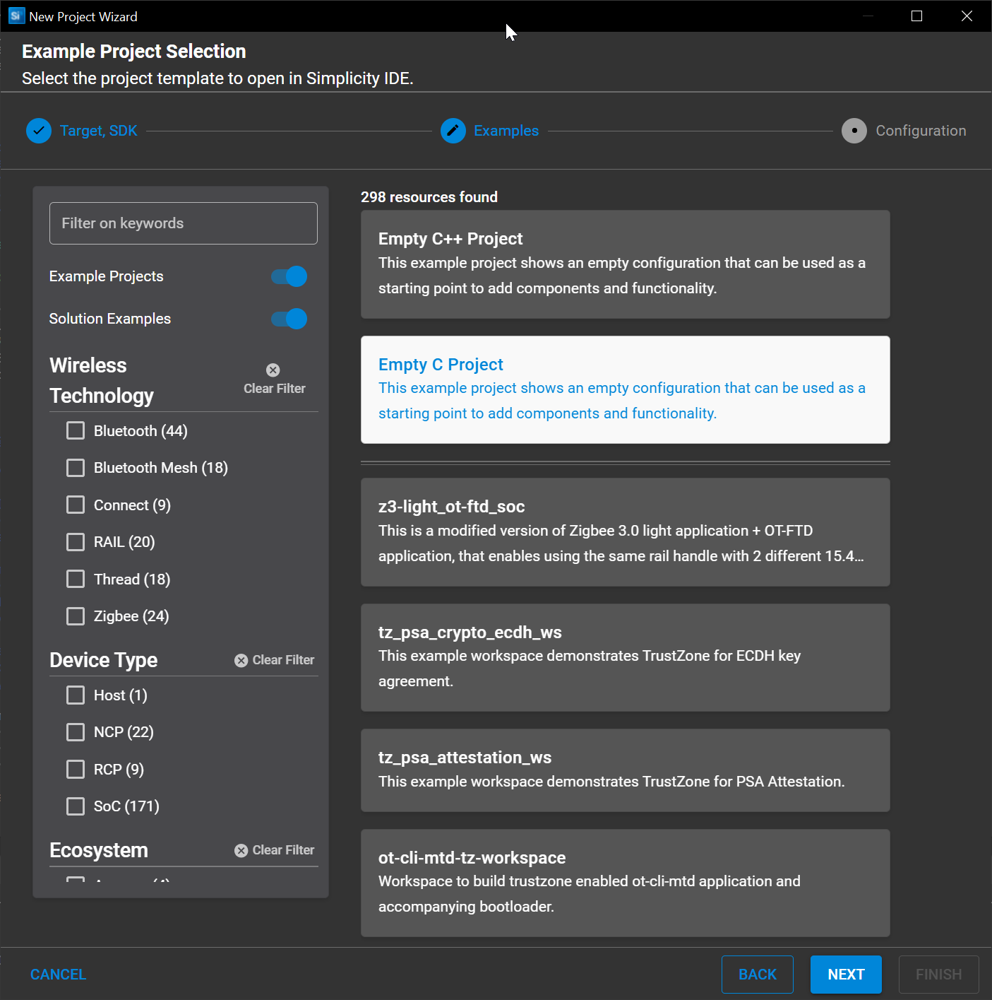
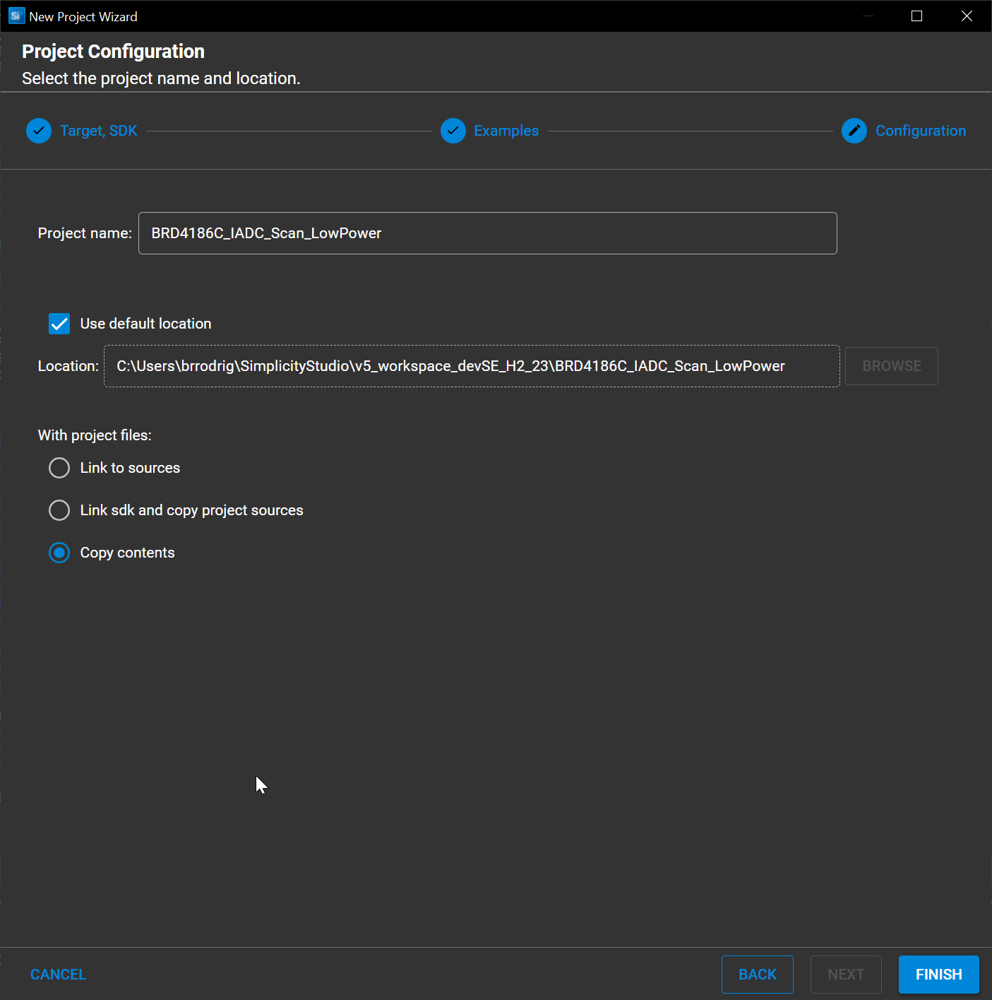

# Base Project Creation And Configuration #

## Project Creation ##

  1. Plug-in your radio board + dev kit to your computer

  2. Open `Simplicity Studio > File > New > Silicon Labs Project Wizard`

  3. If your radio board was plugged in and GSDK installed, you should have all fields pre-filled.

      Otherwise just customize the project base settings accordsing to your needs

      

      In this case we will be using a `BRD4186C` radio board

  4. On the subsequent screen select `Empty C Project`
  
      This will create a regular Silicon Labs SLCP based project with no RF support nor any hardware dependency

      It will bring in the minimum required to get started with a radio board

      

      Click Next

  5. Rename your project as you whish, ours will be `BRD4186C_IADC_Scan_LowPower`

      

      If you wish to, you can also set your project to copy all sources from the Gecko SDK locally upon configuration

      This allows for easier versioning but complexifies import/export

  6. Click Finish to proceed with project creation

## Project Configuration ##

To enable and use Silicon Labs' IADC we will need to enable several `Software Components` :

* IADC
* PRS
* LETIMER
* LDMA

These 4 components will bring in the required EMLIB (lowest level peripheral drivers) into our project so we can build our application on top of it

At this point you should be able to build your project with no errors
