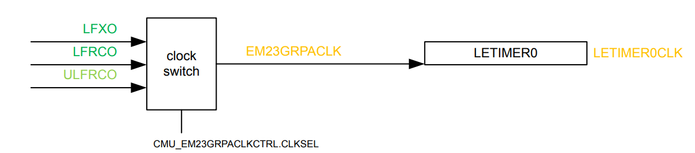

# Base Project Implementation

## Project Architecture

The goal of this project is to perform periodic channels scans while operating in EM2 at the lowest possible power consumption

The only moment the MCU gets involved is once LDMA has ended samples transfer

```text
While in EM2 :

_|‾|_LFXO.32768Hz_|‾|_      -> LETIMER ----------- PRS CHx -----------> IADC.StartScan every 14 LFXO ticks

_|‾|_HFRCOEM23.20MHz_|‾|_   -> IADC.ScanDone ----- LDMA_Request ------> Samples Transfer (bursts of 8 samples)

_|‾|_SYSCLK.39MHz_|‾|_      -> LDMA.ISR_Done (every 128 samples transferred) -----> Code handling

```

This guide aims at getting the best balance between consumption and sample timing accuracy. This is why we will tweak usual code in sample apps provided by Silicon Labs :

* We will not use Power Manager
* We will clock out IADC from HFRCO and not FSRCO (at the cost of ~ 107uA@20MHz; see datasheet table 4.27)

    This will improve IADC clock accuracy to ±3% over the whole temperature range and product life

## Project Code

The code will consist in configuring the 4 hardware blocks we included the drivers earlier

Each will at least impose an init function, and LDMA will involve an ISR Handler to be defined

### LETIMER Code

If the project was properly configured, the LETIMER should be clocked using LFXO as below (see RM Figure 8.3 ):



The responsible code is located in `autogen/sl_device_init_clocks.c` :

```c
  CMU_CLOCK_SELECT_SET(EM23GRPACLK, LFXO);
```

Just to ensure our code is framework independant, we will set it using `CMU_ClockSelectSet(cmuClock_EM23GRPACLK, cmuSelect_LFXO);`

The init function of the LETIMER is as below :

```c
static void letimerInit(void)
{
  // Declare init struct
  LETIMER_Init_TypeDef init = LETIMER_INIT_DEFAULT;

  // Select LETimer0 clock to run off LFXO
  // Reference: EFR32xG24 RM, Figure 8.3
  CMU_ClockSelectSet(cmuClock_EM23GRPACLK, cmuSelect_LFXO);
  // Enable LETimer0 clock
  CMU_ClockEnable(cmuClock_LETIMER0, true);

  // Initialize letimer to run in free running mode
  // Reference: EFR32xG24 RM, Section 18.3.2
  init.repMode = letimerRepeatFree;
  // Pulse output for PRS
  init.ufoa0 = letimerUFOAPulse;
  // Set desired frequency
  // Warning : Trig each Topvalue+1, so minus 1 is needed, but not done in LETIMER_Init
  init.topValue = SAMPLING_TIME_TICK-1; //CMU_ClockFreqGet(cmuClock_LETIMER0) / SAMPLING_FREQ_HZ;

  // Enable letimer
  //init.enable = true; //We chose to enable the LETIMER once all the other acquisition chain members are 
  init.debugRun = false;

  LETIMER_IntClear(LETIMER0, LETIMER_IEN_UF);
  LETIMER_IntEnable(LETIMER0, LETIMER_IEN_UF);

  //NVIC_ClearPendingIRQ(LETIMER0_IRQn);
  //NVIC_EnableIRQ(LETIMER0_IRQn);

  NVIC_ClearPendingIRQ(LETIMER0_IRQn);
  NVIC_DisableIRQ(LETIMER0_IRQn);
  NVIC_SetPriority(LETIMER0_IRQn, LETIMER_IRQ_PRIORITY);

  // Initialize free-running letimer
  LETIMER_Init(LETIMER0, &init);
}
```

Where `SAMPLING_TIME_TICK` is defined as :

```c
#define LETIMER_IRQ_PRIORITY              0 //Makes use of NVIC_IPRn. See : https://developer.arm.com/documentation/ka001285/latest/
#define SAMPLING_TIME_TICK                14u // top value for timer @ 32768Hz = CMU_ClockFreqGet(cmuClock_LETIMER0) / SAMPLING_FREQ_HZ
```

### IADC Code ###

The IADC implementation is more complex as it requires to set :

* The IADC block configuration
* The 2 scan configurations that we will be using and have the IADC automatically switch from
* The 8 channels that we will sample

***The first part of the code will be IADC config:***

```c
void initIADC (void)
{
  // Declare init structs
  IADC_Init_t init = IADC_INIT_DEFAULT;
  IADC_AllConfigs_t initAllConfigs = IADC_ALLCONFIGS_DEFAULT;

  IADC_InitScan_t initScan = IADC_INITSCAN_DEFAULT;
  IADC_ScanTable_t initScanTable = IADC_SCANTABLE_DEFAULT; // Scan Table

  // Enable IADC clock
  CMU_ClockEnable(cmuClock_IADC0, true);
  CMU_ClockEnable(cmuClock_GPIO, true);

  // Reset IADC to reset configuration in case it has been modified
  IADC_reset(IADC0);

  // Configure IADC clock source for use while in EM2
  // Set HFRCOEM23 (used by IADC) to specified frequency band
#if defined(CMU_CLKEN0_HFRCOEM23)
  CMU->CLKEN0_SET = CMU_CLKEN0_HFRCOEM23;
#endif
  HFRCOEM23->CAL = DEVINFO->HFRCOEM23CAL[HFRCOEM23_CAL_INDEX].HFRCOEM23CAL;
  HFRCOEM23->CTRL |= HFRCO_CTRL_EM23ONDEMAND;//Constant jitter if WU from EM2 -> 1.4us
  //HFRCOEM23->CTRL |= HFRCO_CTRL_FORCEEN;//REDUCES JITTER, BUT NOT COMLETELY
  CMU_ClockSelectSet(cmuClock_IADCCLK, cmuSelect_HFRCOEM23);

  init.iadcClkSuspend0 = false;//Turn off clocks between scan acquisitions, allows for better power consumption figures

  // Modify init structs and initialize
  init.warmup = iadcWarmupNormal;// This shows 9us between TIMER_TRIGGER and 1st SCAN_ENTRY_DONE


  // Set the HFSCLK prescale value here
  init.srcClkPrescale = IADC_calcSrcClkPrescale(IADC0, CLK_SRC_ADC_FREQ, 0);//0 Will fetch the values of the frequency from the IADC_ClkSel
  init.timebase = IADC_calcTimebase(IADC0, CLK_SRC_ADC_FREQ);//0 Will fetch the values of the frequency from the IADC_ClkSel

```

Where defines are :

```c
// How many samples to capture
#define NUM_SAMPLES                       128

// Set CLK_ADC to 20MHz
#define CLK_SRC_ADC_FREQ                  20000000 // Targeted CLK_SRC_ADC after prescaling applied set to 20MHz

#if (CLK_SRC_ADC_FREQ == 20000000)
#define HFRCOEM23_CAL_INDEX               9
#elif(CLK_SRC_ADC_FREQ == 38000000)
#define HFRCOEM23_CAL_INDEX               12
#endif
```

This section has quite important settings that allow good balance between power consumption and accuracy.

The first notable setting is the HFRCO wake up behavior controlled by `HFRCOEM23->CTRL |= HFRCO_CTRL_EM23ONDEMAND;` or `HFRCOEM23->CTRL |= HFRCO_CTRL_FORCEEN;`.

Either requires to be set for the IADC to be properly clocked during EM2 operation. EM23ONDEMAND will allow teh MCU to turn the HFRCO on whenever required, while FORCEEN will keeep it always on.

Using EM23ONDEMAND :

This means that whenever the IADC will initiate **one** scan sequence (8 samples) in EM2, it will take some time to wake the HFRCO up. This results in a measure +1.4us delay from the start trigger compared to using FORCEEN.

The next setting that is worth looking at is `init.iadcClkSuspend0`. This allows the IADC to turn its clocks off in between each scan sequence (8 samples). This works in conjunction with HFRCO.CTRL.EM23ONDEMAND.

**Note :** init.iadcClkSuspend1 is dedicated to IADC acquiring single channels (not applicable when set to scan)

***The Second part of the code will be Scan configuration:***

```c
    /*
    * Configuration 0 is used by both scan and single conversions by
    * default.  Use internal bandgap as the reference and specify the
    * reference voltage in mV.
    *
    * Resolution is not configurable directly but is based on the
    * selected oversampling ratio (osrHighSpeed), which defaults to
    * 2x and generates 12-bit results.
    */
    //Diff measurements
    initAllConfigs.configs[DIFFERENTIAL_CONFIG].reference = iadcCfgReferenceInt1V2;
    initAllConfigs.configs[DIFFERENTIAL_CONFIG].vRef = 1210;

    initAllConfigs.configs[DIFFERENTIAL_CONFIG].osrHighSpeed = iadcCfgOsrHighSpeed32x;
    initAllConfigs.configs[DIFFERENTIAL_CONFIG].analogGain = iadcCfgAnalogGain4x;

    // Divides CLK_SRC_ADC to set the CLK_ADC frequency
    // Default oversampling (OSR) is 2x, and Conversion Time = ((4 * OSR) + 2) / fCLK_ADC
    // Combined with the 2 cycle delay when switching input channels, total sample rate is 833ksps
    initAllConfigs.configs[DIFFERENTIAL_CONFIG].adcClkPrescale = IADC_calcAdcClkPrescale(IADC0,
                                                                            CLK_ADC_FREQ_GAIN_4X,
                                                                            CLK_SRC_ADC_FREQ,
                                                                    iadcCfgModeNormal,
                                                                    init.srcClkPrescale);

    //SE measurements
    initAllConfigs.configs[SINGLE_ENDED_CONFIG].reference = iadcCfgReferenceInt1V2;
    initAllConfigs.configs[SINGLE_ENDED_CONFIG].vRef = 1210;

    initAllConfigs.configs[SINGLE_ENDED_CONFIG].osrHighSpeed = iadcCfgOsrHighSpeed2x;
    initAllConfigs.configs[SINGLE_ENDED_CONFIG].analogGain = iadcCfgAnalogGain0P5x;

    // Divides CLK_SRC_ADC to set the CLK_ADC frequency
    // Default oversampling (OSR) is 2x, and Conversion Time = ((4 * OSR) + 2) / fCLK_ADC
    // Combined with the 2 cycle delay when switching input channels, total sample rate is 833ksps
    initAllConfigs.configs[SINGLE_ENDED_CONFIG].adcClkPrescale = IADC_calcAdcClkPrescale(IADC0,
                                                                    CLK_ADC_FREQ_GAIN_0P5X,
                                                                    CLK_SRC_ADC_FREQ,
                                                                    iadcCfgModeNormal,
                                                                    init.srcClkPrescale);


  // Scan initialization
  // On every trigger, start conversion
  initScan.triggerAction = iadcTriggerActionOnce;

  // Set conversions to trigger from PRS
  initScan.triggerSelect = iadcTriggerSelPrs0PosEdge;

  initScan.dataValidLevel = iadcFifoCfgDvl8;

  // Set alignment to the left 16 bits
  initScan.alignment = iadcAlignRight16;

  // Enable triggering of scan conversion
  //initScan.start = true;

  // Set to run in EM2
  initScan.fifoDmaWakeup = true;

  initScan.showId = true;
```

Where defines are set as :

```c
// Takes Errata IADC_E306 into account
#define CLK_ADC_FREQ_GAIN_4X              2500000 // CLK_ADC - 2.5MHz max in gain 4x
#define CLK_ADC_FREQ_GAIN_0P5X            10000000 // CLK_ADC - 10MHz max in 0.5x gain

#define SINGLE_ENDED_CONFIG               0
#define DIFFERENTIAL_CONFIG               1
```

A few settings here are due to errata IADC_E306 which states that some GAIN settings must force the IADC sampling frequency must be under a certain range. This is not the IADC source clock, but its sampling frequency.

In this setup we will configure 2 scan configurations that the IADC will be able to switch to/from :

* One being sampling single-ended inputs
* The other sampling differential inputs

We will not cover the details of OSR, GAIN and VREF as they are arbitrarily chosen in this guide to highlight the diversity of configurations and conditions.

The other settings to note are :

* `initScan.triggerAction = iadcTriggerActionOnce;`

    Which gets the IADC trigger one scan sequence (8 samples) every time its trigger condition is reached

* `initScan.triggerSelect = iadcTriggerSelPrs0PosEdge;`

    Which sets the IADC to trigger upon PRS_Consummer.IADC_SCANTRIGGER
    `iadcTriggerSelPrs1PosEdge` would trigger sigle operations

* `initScan.dataValidLevel = iadcFifoCfgDvl8;`

    Which will tell the IADC to only trigger an LDMA Request once its fifo has reached 8 valid samples.

* `initScan.fifoDmaWakeup = true;`

    Which will allow the LDMA to be woken up and triggered from EM2

Other settings only apply to data formatting and have no impact on IADC timing, consumption or logic.

Once all is set, we let `initScan.start = true;` commented out as we will enable it later once the whole chain is ready.

***The Last part of the code will be Scan table and IO configurations:***

```c
  // Configure entries in scan table
  // 0, 1 & 2 -> Single ended inputs
  // 3, 4 & 5 -> Differential inputs
  // Takes Errata IADC_E306 into account
  initScanTable.entries[0].posInput = IADC_POS_INPUT_0_PORT_PIN;//SE1
  initScanTable.entries[0].negInput = IADC_NEG_INPUT_0_PORT_PIN;
  initScanTable.entries[0].includeInScan = true;
  initScanTable.entries[0].configId = SINGLE_ENDED_CONFIG;

  initScanTable.entries[1].posInput = IADC_POS_INPUT_1_PORT_PIN;//SE2
  initScanTable.entries[1].negInput = IADC_NEG_INPUT_1_PORT_PIN;
  initScanTable.entries[1].includeInScan = true;
  initScanTable.entries[1].configId = SINGLE_ENDED_CONFIG;

  initScanTable.entries[2].posInput = IADC_POS_INPUT_2_PORT_PIN;//SE3
  initScanTable.entries[2].negInput = IADC_NEG_INPUT_2_PORT_PIN;
  initScanTable.entries[2].includeInScan = true;
  initScanTable.entries[2].configId = SINGLE_ENDED_CONFIG;

  initScanTable.entries[3].posInput = IADC_POS_INPUT_3_PORT_PIN;//D1
  initScanTable.entries[3].negInput = IADC_NEG_INPUT_3_PORT_PIN;
  initScanTable.entries[3].includeInScan = true;
  initScanTable.entries[3].configId = DIFFERENTIAL_CONFIG;

  initScanTable.entries[4].posInput = IADC_POS_INPUT_4_PORT_PIN;//D2
  initScanTable.entries[4].negInput = IADC_NEG_INPUT_4_PORT_PIN;
  initScanTable.entries[4].includeInScan = true;
  initScanTable.entries[4].configId = DIFFERENTIAL_CONFIG;

  initScanTable.entries[5].posInput = IADC_POS_INPUT_5_PORT_PIN;//D3
  initScanTable.entries[5].negInput = IADC_NEG_INPUT_5_PORT_PIN;
  initScanTable.entries[5].includeInScan = true;
  initScanTable.entries[5].configId = DIFFERENTIAL_CONFIG;

  initScanTable.entries[6].posInput = IADC_POS_INPUT_6_PORT_PIN;//SE4
  initScanTable.entries[6].negInput = IADC_NEG_INPUT_6_PORT_PIN;
  initScanTable.entries[6].includeInScan = true;
  initScanTable.entries[6].configId = SINGLE_ENDED_CONFIG;

  initScanTable.entries[7].posInput = iadcPosInputAvdd;//SE5, connected to AVDD
  initScanTable.entries[7].negInput = iadcNegInputGnd;
  initScanTable.entries[7].includeInScan = true;
  initScanTable.entries[7].configId = SINGLE_ENDED_CONFIG;

  //Reserve all ABUS ports for IADC
  GPIO->BBUSALLOC |= GPIO_BBUSALLOC_BODD0_ADC0;
  GPIO->BBUSALLOC |= GPIO_BBUSALLOC_BODD1_ADC0;

  GPIO->BBUSALLOC |= GPIO_BBUSALLOC_BEVEN0_ADC0;
  GPIO->BBUSALLOC |= GPIO_BBUSALLOC_BEVEN1_ADC0;


  GPIO->ABUSALLOC |= GPIO_ABUSALLOC_AODD0_ADC0;
  GPIO->ABUSALLOC |= GPIO_ABUSALLOC_AODD1_ADC0;

  GPIO->ABUSALLOC |= GPIO_ABUSALLOC_AEVEN0_ADC0;
  GPIO->ABUSALLOC |= GPIO_ABUSALLOC_AEVEN1_ADC0;

  // Initialize IADC
  IADC_init(IADC0, &init, &initAllConfigs);

  // Initialize Scan
  IADC_initScan(IADC0, &initScan, &initScanTable);

}

```

This code only sets up the scan table so the IADC knows in which order and to which GPIOs to proceed during scan.

***Note 1:*** Errata IADC_E306 states that during a scan sequence, entry 0 must be using the same config as the last entry (here 7).

***Note 2:*** 8th entry is a dummy one to align the `initScan.dataValidLevel = iadcFifoCfgDvl8;` with the number of entries. This allows the LDMA to perform optimally.

We will not put the whole defines here to shorten the guide, but IOs must me defined as below :

```c
#define IADC_POS_INPUT_0_PORT_PIN         iadcPosInputPortBPin3//EXP #3
#define IADC_NEG_INPUT_0_PORT_PIN         iadcNegInputGnd;
```

Finally, the last lines will cover analog bus configuration as per GPIO block

Analog bus configuration is done in the GPIO block. Silicon Labs documented it in the GPIO section of its reference manual. See section 24.3.12.2 of the `efr32xg24-rm.pdf` :

```text
Analog peripherals may be connected to any pins on port A, B, C, or D via the Analog Bus. There are three analog buses on the
EFR32xG24: one dedicated to Port A (ABUSA), one dedicated to port B (ABUSB), and one that serves both ports C and D (ABUSCD).

The specific pin and port selection for analog resources are configured in the analog peripherals. Refer to the respective analog peripheral chapter for this information. However, the GPIO block must be configured to grant the peripheral access to an ABUS before any
connection can be made.

Note: The analog signals on ABUSes will be voltage limited by the lowest supply voltage of IOVDD and AVDD.

Up to two analog peripherals may be given access to an ABUS at any one time and the even/odd pins of each bus are configured
independently. 

This means that a single bus may have up to four different analog peripherals connected to it: two on the even pins and two on the odd pins. 

The GPIO_ABUSxALLOC register, where x is the port, determines which peripherals have access to the bus. 
To grant a peripheral access to the bus even pins select it in either the EVEN0 or EVEN1 field. To grant a peripheral access to the bus odd pins select it in either the ODD0 or ODD1 fields.

When a differential connection is being used, positive inputs are restricted to the EVEN pins and negative inputs are restricted to the ODD pins. 
When a single ended connection is being used, the positive input is avaliable on all pins.
```

Since we will be using 8 GPIOs either ODD or even, from both Port A and Port B, we need to tell the GPIO block that the IADC will be the owner of these ABUS ports

### LDMA Code

The last functionnal block to be initialized is the LDMA. It will allow us to transfer our bursts of 8 samples to a total amount of 128 (16 times) and evenmtually trigger an ISR for our application to retrieve and use the data.

***The init code is :***
```c
void initLDMA(uint32_t *buffer, uint32_t size)
{
  // Declare LDMA init structs
  LDMA_Init_t init = LDMA_INIT_DEFAULT;

  // Enable LDMA clock branch
  CMU_ClockEnable(cmuClock_LDMA, true);

  init.ldmaInitIrqPriority = LDMA_IRQ_PRIORITY;

  // Initialize LDMA with default configuration
  LDMA_Init(&init);

  // Configure LDMA for transfer from IADC to memory
  // Set up descriptors for buffer transfer
  descriptor = (LDMA_Descriptor_t)LDMA_DESCRIPTOR_LINKREL_P2M_WORD(&IADC0->SCANFIFODATA, buffer, size, 0);

  // Set descriptor to loop NUM_SAMPLES times and run continuously
  descriptor.xfer.decLoopCnt = 0;
  descriptor.xfer.xferCnt = (NUM_SAMPLES - 1) ;
  descriptor.xfer.blockSize = ldmaCtrlBlockSizeUnit8;

  // Interrupt after transfer complete
  descriptor.xfer.doneIfs = 1;
  descriptor.xfer.ignoreSrec = 1;

  // Start transfer, LDMA will sample the IADC NUM_SAMPLES time, and then interrupt
  //LDMA_StartTransfer(IADC_LDMA_CHANNEL, (void*)&transferCfg, (void*)&descriptor);
}
```

Where macros are defined as :

```c
#define LDMA_IRQ_PRIORITY                 1 //Makes use of NVIC_IPRn. See : https://developer.arm.com/documentation/ka001285/latest/
#define NUM_SAMPLES                       128
```

Where global variables are :

```c
// Globally declared LDMA link descriptor
LDMA_Descriptor_t descriptor;

// buffer to store IADC samples
uint32_t scanBuffer[NUM_SAMPLES] = {0xFF};
LDMA_TransferCfg_t transferCfg = LDMA_TRANSFER_CFG_PERIPHERAL(ldmaPeripheralSignal_IADC0_IADC_SCAN);
```

Here we enable the LDMA and set one relative peripheral to memory descriptor, which loops to itself.

We also set the the whole transfer to be 128 samples (`descriptor.xfer.xferCnt = (NUM_SAMPLES - 1) ;`) prior to triggering an ISR `descriptor.xfer.doneIfs = 1;`

`descriptor.xfer.ignoreSrec = 1;` and `descriptor.xfer.blockSize = ldmaCtrlBlockSizeUnit8;` allow altogether to only perform transfers of 8 bytes and avoid any single transfer. This is why we set the IADC to DVL8 earlier.

Once more we leave LDMA_StartTransfer commented out for once the whole chain is initialized.

Finally we declare the transferCfg to be preset for `ldmaPeripheralSignal_IADC0_IADC_SCAN` to trigger LDMA requests.

The LDMA ISR will do nothing, but if it were to be used we would need to define :

```c
void LDMA_IRQHandler(void)
{
  // Clear interrupt flags
  LDMA_IntClear(LDMA_IF_DONE0);
}
```

### PRS Code

The last piece of software required is the PRS initialization code. This will allow us to chain all the blocks together.

***PRS init code is :***

```c
static void initPrs(void)
{
  CMU_ClockEnable(cmuClock_GPIO, true);
  CMU_ClockEnable(cmuClock_PRS, true);

  iadcTriggerPrsChannel = PRS_GetFreeChannel(prsTypeAsync);

  if(iadcTriggerPrsChannel > 5)
  {
    while(1);//wont work on port A B
  }

  // LETIMER --------- PRS CHx --------> IADC0
  PRS_SourceAsyncSignalSet(iadcTriggerPrsChannel,
                           PRS_ASYNC_CH_CTRL_SOURCESEL_LETIMER0,
                           PRS_ASYNC_CH_CTRL_SIGSEL_LETIMER0CH0);

  // Select PRS channel 1 as trigger for IADC Scan trigger
  PRS_ConnectConsumer(iadcTriggerPrsChannel,
                      prsTypeAsync,
                      prsConsumerIADC0_SCANTRIGGER);

#if DEBUG_IADC_SCAN_DONE_GPIO

  iadcScanDonePrsChannel = PRS_GetFreeChannel(prsTypeAsync);
  if(iadcScanDonePrsChannel > 5)
      {
        while(1);//wont work on port A B
      }

  PRS_SourceAsyncSignalSet(iadcScanDonePrsChannel,
                             PRS_ASYNC_CH_CTRL_SOURCESEL_IADC0,
                             PRS_ASYNC_CH_CTRL_SIGSEL_IADC0SCANDONE);

  GPIO_PinModeSet(IADC_SCAN_DONE_GPIO_PORT, IADC_SCAN_DONE_GPIO_PIN, gpioModePushPull,1);
  PRS_PinOutput(iadcScanDonePrsChannel, prsTypeAsync, IADC_SCAN_DONE_GPIO_PORT, IADC_SCAN_DONE_GPIO_PIN);
#endif //#if DEBUG_IADC_SCAN_DONE_GPIO

#if DEBUG_IADC_SCAN_ENTRY_DONE_GPIO
  GPIO_PinModeSet(IADC_SCAN_ENTRY_DONE_GPIO_PORT, IADC_SCAN_ENTRY_DONE_GPIO_PIN, gpioModePushPull,1);
  iadcScanEntryDonePrsChannel = PRS_GetFreeChannel(prsTypeAsync);
  if(iadcScanEntryDonePrsChannel > 5)
  {
    while(1);//wont work on port A B
  }

  PRS_SourceAsyncSignalSet(iadcScanEntryDonePrsChannel,
                             PRS_ASYNC_CH_CTRL_SOURCESEL_IADC0,
                             PRS_ASYNC_CH_CTRL_SIGSEL_IADC0SCANENTRYDONE);

  PRS_PinOutput(iadcScanEntryDonePrsChannel, prsTypeAsync, IADC_SCAN_ENTRY_DONE_GPIO_PORT, IADC_SCAN_ENTRY_DONE_GPIO_PIN);

#endif //#if DEBUG_IADC_SCAN_ENTRY_DONE_GPIO

#if DEBUG_TIMER_TRIGGER_GPIO
  GPIO_PinModeSet(TIMER_TRIGGER_GPIO_PORT, TIMER_TRIGGER_GPIO_PIN, gpioModePushPull,1);
  PRS_PinOutput(iadcTriggerPrsChannel, prsTypeAsync, TIMER_TRIGGER_GPIO_PORT, TIMER_TRIGGER_GPIO_PIN);
  //CMU_ClkOutPinConfig(HFRCO_CLKOUT_NO, cmuSelect_HFRCOEM23, 1, HFRCO_GPIO_PORT, HFRCO_GPIO_PIN);
#endif

}
```

The only global variable used in this guide is `iadcTriggerPrsChannel` but overall :

```c
uint32_t iadcTriggerPrsChannel = 0;
uint32_t iadcScanDonePrsChannel = 0;
uint32_t iadcScanEntryDonePrsChannel = 0;
```

The above code connects the LETIMER Channel 0 to the IADC scan trigger event. This will enable the entire chain to be triggered.

PRS can also be used to debug the IADC FSM, hence coditianl code present in the function. However these will not be used in this guide

### APP Init Code

To enable the whole chain, we implemetned the following to be called in `app_init()`:

```c
static void startSampling(void)
{
  if( !startedSampling )
  {
    //Load Scan sequence (untriggered)
    IADC_command(IADC0, iadcCmdStartScan);
    // Start LDMA (untriggered)
    LDMA_StartTransfer(IADC_LDMA_CHANNEL, (void*)&transferCfg, (void*)&descriptor);
    // One of the desc has doneIfs set, so interrupt should be activated on the channel :
    LDMA->IEN |= 1UL << (uint8_t)IADC_LDMA_CHANNEL; // Allow  interrupt to be fired by any desc
    // Set flag to indicate sampling is occuring.
    startedSampling = true;
    //Enable LETIMER (will trigger after 14 ticks)
    LETIMER_Enable(LETIMER0, true);
  }
}
```

Where defines are :

```c
// Number of scan channels
#define IADC_LDMA_CHANNEL                 0 // Highest priority LDMA channel
```

And with single global variable being :

```c
static bool startedSampling = false;
```

### APP Process Code

Last but not the least, we need low power support. To achieve this, we willm call `EMU_EnterEM2(true)` with clock restoration in `app_process_action()` :

```c
void app_process_action(void)
{
    EMU_EnterEM2(true);
}
```

The whole project is available in [this repository](https://github.com/brian-silabs/BRD4186C_IADC_Scan_LowPower)
