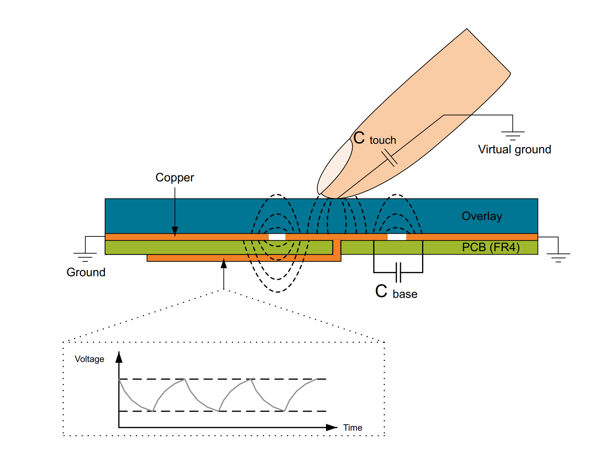
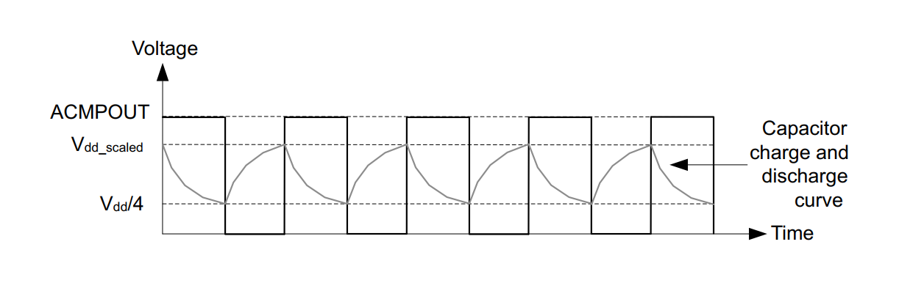
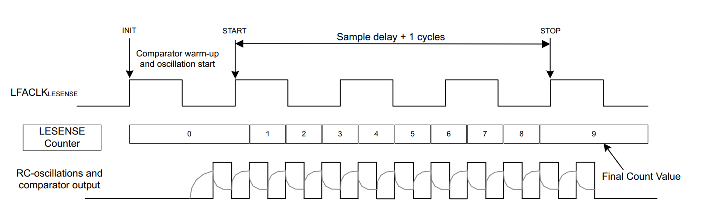

## Introduction

       
LESENSE is a peripheral available in some of the EFR32 series 2, mainly the one targetting mettering applications.
It enables the possibility to autonomously perform a low energy measurement requiring or a sensor stimulation.

In this exemple we will use the LESNSE to start and stop the ACMP comparator configured in capsense mode to capture and compare a count of pulses. 
In a touch arrangement, the RC formed by the capsense feedback in the comparator and the touch generate an oscillation of the signal on the touch which lower un frequency if the hand or a finger are approching. The threshold of comparison will then be crossed down on touch allowing the detection.

This is shown below.

Details of the comparator behavior.

Details of the LESENSE behavior.

In this project, we will use PA11 as our capsense touch input and optionnaly PD07 as the comparator output pin for debug purpose.