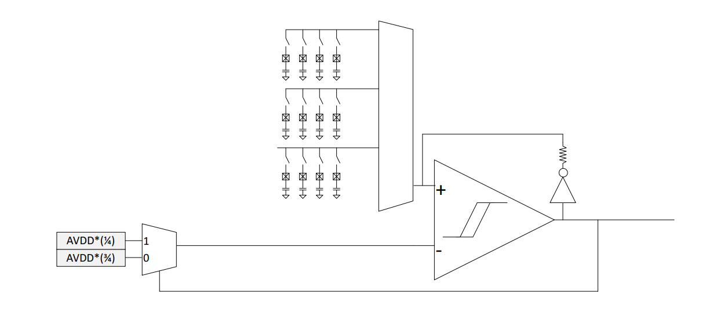
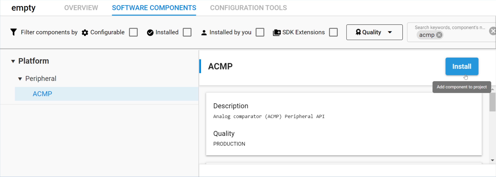

## Adding ACMP configuration to the project

  1.  How the ACMP works and need to be configured.

  

  The comparator will be used in capsense mode.
  The capsense mode is adding a resistive feedback between the output and the positive input.
  This will form a RC oscillator together with the capacitive touch connected to the positive input.
  
  2.  First add ACMP component in the project

  

  3.  open app.c and add the ACMP init

  add the following definition on top of the file:
 
 ```c
  #include "em_cmu.h"
  #include "em_acmp.h"
  #include "em_gpio.h"

  #define TOUCH_PORT            ACMP_INPUTCTRL_POSSEL_EXTPA //ACMP input port selection
  #define TOUCH_PIN             11       //ACMP touch pin selection
  #define ACMP_BUSALLOC         ((TOUCH_PIN % 2)?(GPIO_ABUSALLOC_AODD0_ACMP0):(GPIO_ABUSALLOC_AEVEN0_ACMP0))
 ```

  add the following init function above app_init().

 ```c
  static void initACMP(void)
  {

  CMU_ClockEnable(cmuClock_ACMP0, true);

  // ACMP Configuration
  ACMP_Init_TypeDef initACMP = ACMP_INIT_DEFAULT;

  // Initialize ACMP
  ACMP_Init(ACMP0, &initACMP);

  // Allocate BODD0 to ACMP0 to be able to use the input
  GPIO->ABUSALLOC_SET = ACMP_BUSALLOC;

  // Select capsense mode for ACMP negative input
  ACMP0->INPUTCTRL_SET = ACMP_INPUTCTRL_NEGSEL_CAPSENSE;

  // Port B external interface override
  ACMP0->INPUTCTRL_SET = TOUCH_PORT;

  // Wait for warm-up
  while (!(ACMP0->STATUS && ACMP_IF_ACMPRDY));
  // if you want to visualize the ACMP output in EM0/1 mode uncomment below
  // configured on PD07 in this exemple

  //GPIO_PinModeSet(gpioPortD, 7, gpioModePushPull, 0);
  //ACMP_GPIOSetup(ACMP0, gpioPortD, 7, true, false);

  }
   ```

  The init turn on ACMP0 clock to use it, then it uses the default init structure to actually configure it.
  For use together with the LESENSE block which will control it autonomously, we need to configure the GPIO ABUS allocation to
  indicate our capsense touch is on Port A odd pin (PA11).
  Then we configure the inputs in Capsense mode to add the resistive feedback path.
  Finally we set the positive input of the ACMP to the port used as input, just like we did for the GPIO peripheral above. 
  Here it is the PortA therefore ACMP_INPUTCTRL_POSSEL_EXTPA.

  4. call initACMP():

  add the call to the init fuction in app_init() like this:

  ```c
  void app_init(void)
  {
    initACMP();
  }
  ```

ACMP is configured, nevertheless it is not yet fully functionnal until LESENSE is also configured to control it and select the actual pin 11 on port A.
This will be done in next chapter.