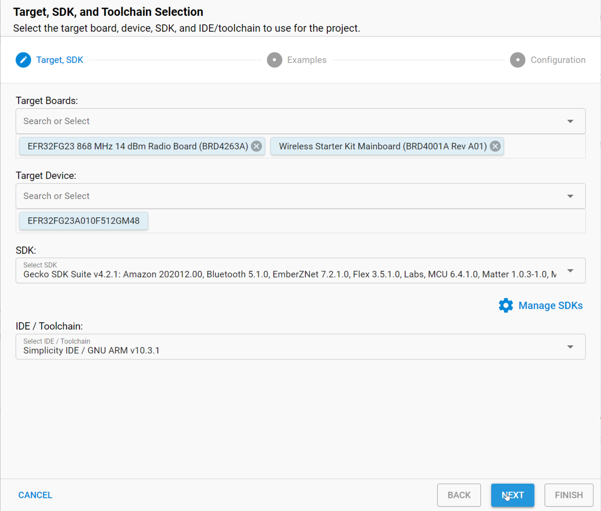
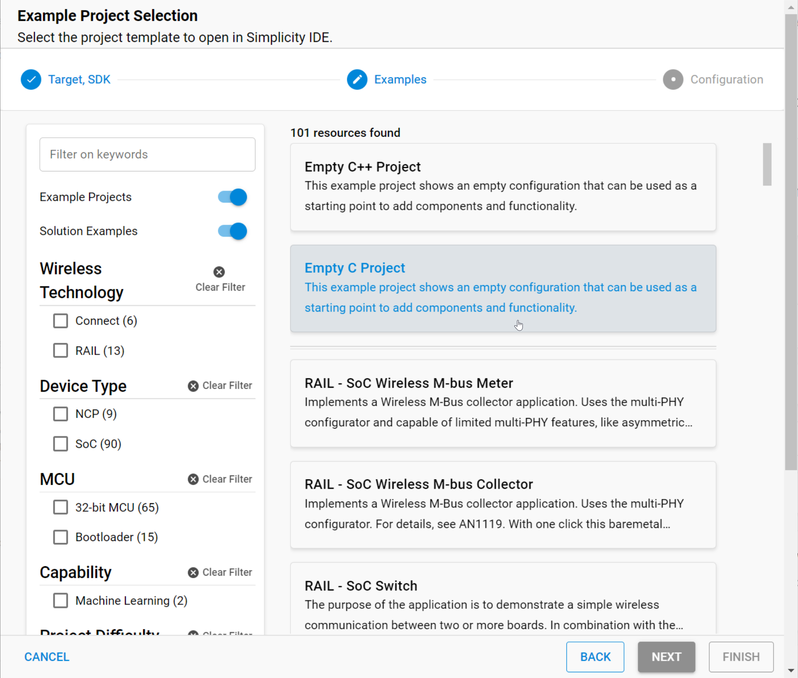

## Getting Started

  1.  Open Simplicity Studio v5

  2.  File --> New --> Silicon Labs Project Wizard

  

  3.  select "Empty C"  project

  

  4. click next

  5. give a name to the project or use the proposed one

  6. click on Finish.

      
Once you have done all of the above, your project is ready and we will be able to modify it