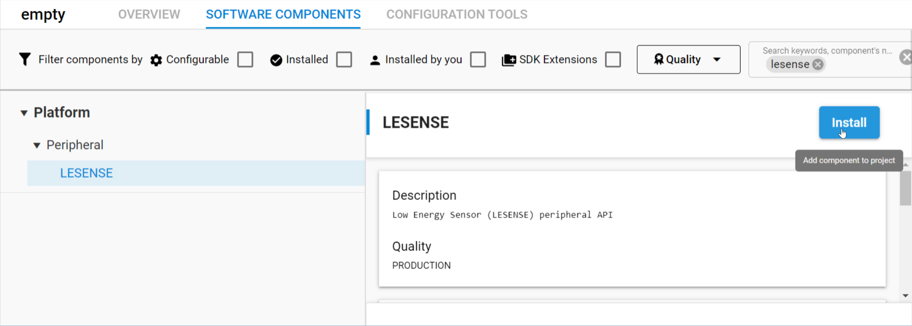
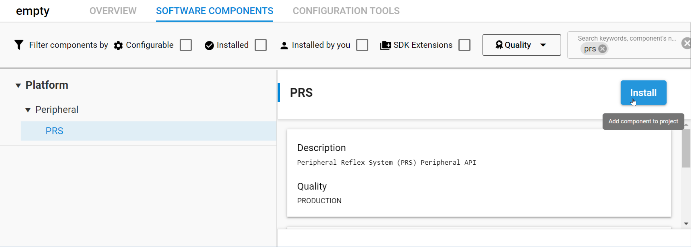

## Adding LESENSE configuration to the project

  1.  How the LESENSE works and need to be configured.

  

  The red path is the one we want to set up now.
  This will configure the LESENSE peripheral to count ACMP pulses and compare them to decide if capsense is
  touched or not touched.
  
  2.  First add LESENSE and PRS components in the project

  
  

  3.  open again app.c and add the LESENSE init

  add the following definition on top of the file:
 
 ```c
  #include "em_lesense.h"
  #include "em_prs"

  #define SCAN_FREQ             8       //scan frequency in Hz
  #define LESENSE_SAMPLE_DELAY  0x80    //number of clock cycles for sampling (1 cycle => 30.5 us)
  #define LESENSE_INITIAL_THRES 3000    //initial number of pulses within the sampling period

 ```

  add the following init function above app_init().

 ```c
  static void initLESENSE(void)
{
  /*****************************************************************************
   * Set LFRCO as EFM32GRPACLK clock source
   * Enable clock for LESENSE
   * 
   *****************************************************************************/
  CMU_ClockSelectSet(cmuClock_EM23GRPACLK, cmuSelect_LFRCO);

  CMU_ClockEnable(cmuClock_LESENSE, true);
  CMU_ClockEnable(cmuClock_PRS, true);

  // LESENSE default configurations
  LESENSE_Init_TypeDef initLesense = LESENSE_INIT_DEFAULT;
  LESENSE_ChDesc_TypeDef initLesenseCh = LESENSE_CH_CONF_DEFAULT;

  // LESENSE core modifications to default for result store and debug support 
  initLesense.coreCtrl.storeScanRes = true;
  initLesense.coreCtrl.debugRun = true;

  // Enable LESENSE control of the ACMP0 positive input mux
  initLesense.perCtrl.acmp0Mode = lesenseACMPModeMux;

  //Initialize LESENSE interface
  LESENSE_Init(&initLesense, true);

  // Channel Configuration
  initLesenseCh.enaScanCh = true;  // Enable scan channel
  initLesenseCh.enaInt = true;     // Enable interrupt
  initLesenseCh.sampleDelay = LESENSE_SAMPLE_DELAY; // Predefined sample delay cycle
  initLesenseCh.sampleMode = lesenseSampleModeCounter; // Pulse counter mode
  initLesenseCh.intMode = lesenseSetIntLevel; // Interrupt on sensor int level
  initLesenseCh.evalMode = lesenseEvalModeThreshold;
  initLesenseCh.compMode = lesenseCompModeLess;
  initLesenseCh.compMode = lesenseCompModeLess;
  initLesenseCh.storeCntRes = true;
  initLesenseCh.offset = TOUCH_PIN; //Set LESENSE offset
  initLesenseCh.cntThres = LESENSE_INITIAL_THRES;

  // Configure channel 0
  LESENSE_ChannelConfig(&initLesenseCh, 0);

  // 8 Hz scan
  LESENSE_ScanFreqSet(0, SCAN_FREQ);

  // Wait for SYNCBUSY clear
  while (LESENSE->SYNCBUSY)
    ;

  LESENSE->EN_SET = LESENSE_EN_EN;  // Enable LESENSE

  while (LESENSE->SYNCBUSY)
    ;         // SYNCBUSY check;

  // Enable interrupt in NVIC
  NVIC_ClearPendingIRQ(LESENSE_IRQn);
  NVIC_EnableIRQ(LESENSE_IRQn);

  // Start continuous scan
  LESENSE_ScanStart();
}
   ```

  The init turn on LESENSE clock to use it, then it uses the default init structures for the core and channel as a bases to configure it.
  
  For the core part, we will just enable debugrun support to allow the LESENSE to run even if the MCU is stopped in a breakpoint.
  We will as well autorise the results of the scan to be stored in RAM.

  

  The channel need a bit more configuration tweakings:
    - set initLesenseCh.enaScanCh = true to enable scan channel
    - set initLesenseCh.enaInt = true to enable channel interrupt
    - set initLesenseCh.sampleDelay = LESENSE_SAMPLE_DELAY to define sample delay duration in 32.768kHz units
    - set initLesenseCh.sampleMode = lesenseSampleModeCounter to enable Pulse counter mode
    - set initLesenseCh.intMode = lesenseSetIntLevel to generate the Interrupt on sensor int level
    - set initLesenseCh.evalMode = lesenseEvalModeThreshold to enable the compare action
    - set initLesenseCh.compMode = lesenseCompModeLess to compare if value is less than threshold (remember touch lower the frequency in the ACMP arrangement)
    - set initLesenseCh.cntThres = LESENSE_INITIAL_THRES to set the actual compare value.
    - set initLesenseCh.storeCntRes = true to store result of the count in RAM
    - set initLesenseCh.offset = TOUCH_PIN to define pin 11 is the one to use in Port A

   Once both core and channel are initialized, the scan frequency is set (8 times a second in our example)

   since LESENSE is a low frequency clock domain peripheral, it is important to wait for all config to be synchronized in this domain. This is done with the "while (LESENSE->SYNCBUSY);".

   Now we can enable the Interrupts and lauch the scan.

  4. call initLESENSE():

  add the call to the init fuction in app_init() like this:

  ```c
  void app_init(void)
  {
    initACMP();
    initLESENSE();
  }
  ```

LESENSE is configured and will now autonomously scan the ACMP on PA11 8 times a seconds for LESENSE_SAMPLE_DELAY*30.5us.
If result of the scan is lees than the threshold an interrupt will be triggered.
This interrupt handling will be set up in the next chapter.